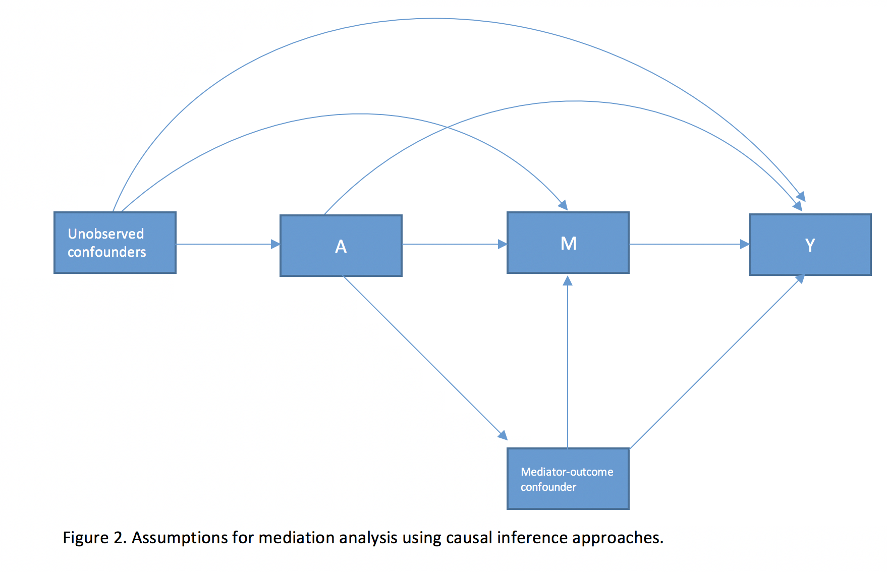

  

**Supervisor**: [Ruth Ottman](https://www.mailman.columbia.edu/people/our-faculty/ro6)    

    

&nbsp;

### ABSTRACT   
**Background**: Genetic influences on the epilepsies are increasingly being emphasized in clinical practice, and genetic testing is becoming a more routine part of clinical care. Hence, understanding of beliefs about epilepsy genetics among unaffected relatives of people with epilepsy is important.  
**Aims**: To investigate, among individuals without epilepsy in multiplex epilepsy families, the impacts on perceived future epilepsy risk of (1) number of relatives with epilepsy and (2) perceived chance of having an epilepsy-related mutation.  
**Methods**: A self-administered questionnaire was completed by 189 individuals without epilepsy from families containing multiple individuals with epilepsy (average 4 affected per family). Questions asked about the number of people with epilepsy in the family, perceived chance of having an epilepsy-related mutation, and perceived future epilepsy risk “compared with the average person.” Complete data on all three questions were available for 103 participants. Associations among total relatives with epilepsy, perceived chance of having epilepsy-related mutation, and perceived future epilepsy risk were assessed by Poisson regression models using generalized estimating equations to adjust for non-independence among members of each family. Mediation analysis was used to test the degree to which the effect of total relatives with epilepsy on perceived future epilepsy risk was mediated by perceived chance of having a mutation. Stratified analyses and Poisson regression were used to explore interaction between number of relatives with epilepsy and perceived chance of having epilepsy-related mutation.  
**Results**: Number of affected relatives (≥4 vs. <4) was significantly associated with perceived future epilepsy risk (“more” vs. “the same or less” than the average person) (Prevalence ratio [PR]=1.9, 95% Confidence interval [CI]=1.08-3.22, p=0.02), and with perceived chance of having an epilepsy-related mutation (PR=1.5, 95% CI=1.04-2.04, p=0.03). Perceived chance of having a mutation was also associated with perceived future epilepsy risk (PR=3.4, 95% CI=1.55-7.46, p=0.002). Mediation analysis indicated that number of affected relatives had a significant total effect (PR=1.9, 95% CI=1.06-3.57) on perceived future epilepsy risk and a significant indirect effect, acting through perceived chance of having a mutation (PR=1.3, 95% CI=1.02-1.65). The direct effect of number of affected relatives was not significant (PR=1.6, 95% CI=0.84-2.95). The proportion of the total effect mediated by perceived chance of having a mutation was 41.0% on risk difference scale. Sub-additive interaction between number of relatives with epilepsy and perceived chance of having an epilepsy-related mutation was detected (Relative Excess Risk due to Interaction [RERI] =-1.5, 95% CI=-8.76-5.67).  
**Conclusions**: Our study began with a conceptual mediation model that then brought us to explore interaction between exposure and mediator in their effects on the outcome. The analysis indicated that the relationship between total relatives with epilepsy and perceived future epilepsy risk was mediated by perceived chance of having an epilepsy-related mutation. A nonsignificant sub-additive interaction was detected between total relatives with epilepsy and perceived chance of having an epilepsy-related mutation, suggesting the potential competitive interaction type in our study.  
