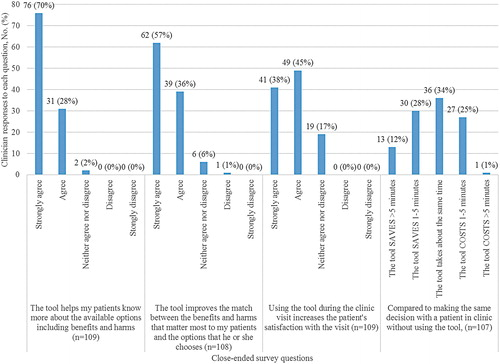

  

  

  

author: Megan Coylewright, Jon G. Keevil, Keren Xu, Shayne E. Dodge, Dominick Frosch, and Michael E. Field  

### Abstract:   
**Background**:Patient decision aids (PDAs) facilitate shared decision-making (SDM) and are delivered in a variety of formats, including printed material or instructional videos, and, more recently, web-based tools. Barriers such as time constraints and disruption to clinical workflow are reported to impede usage in routine practice.

**Introduction**:This pragmatic study examines use of PDAs integrated (iPDAs) into the electronic health record (EHR) over an 8-year period.

**Methods**:A suite of iPDAs that personalize decision-making was integrated into an academic health system EHR. Clinician use was tracked using patient and clinician encrypted information, enabling identification of clinician types and unique uses for an 8-year period. Clinician feedback was obtained through survey.

**Results**:Over 8 years, 1,209 identifiable clinicians used the iPDAs at least once (“aware”). Use increased over time, with 2,415 unique uses in 2010, and 23,456 in 2017. Clinicians who used an iPDA with at least 5 patients (“adopters”), increased by 82 clinicians each year (range 56–108); of clinicians who used the tool once, 54.3% became adopters. Of 261 primary care clinicians, 93.5% were aware, 86.2% were adopters, and 80.5% used the tools in the last 90 days. Clinicians perceived the iPDAs to be convenient, efficient, and encouraging of SDM.  

**Discussion**:We demonstrate that use of decision aids integrated into the EHR result in repeated use among clinicians over time and have the potential to overcome barriers to implementation. We noted a high degree of clinician satisfaction, without a sense of increase in visit time.

**Conclusion**:Integration of PDAs into the EHR results in sustained use. Further research is needed to assess the impact of iPDAs on decisional quality.  

